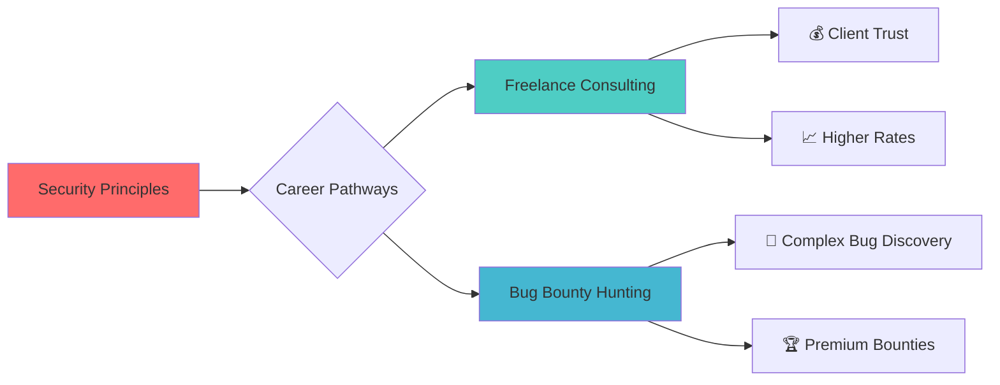
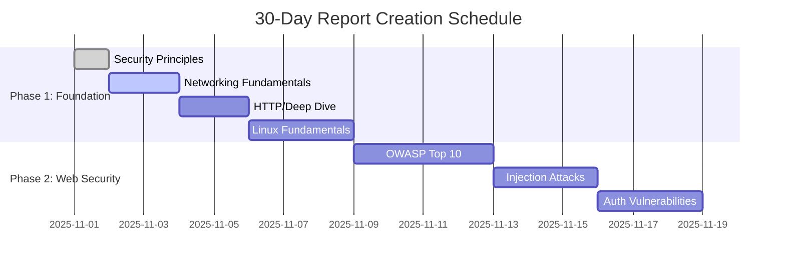

🏆 Professional Security Assessment Report

Foundational Principles for Secure Architecture & Threat Mitigation

---

📋 Report Metadata

Item Details
Report ID THM-SEC-001
Author Asibur Rahaman
Certification Track Offensive Security Foundations
Assessment Platform TryHackMe
Room Complexity ⭐⭐⭐☆☆ (Foundation)
Completion Time 1.8 hours
Report Generation Date November 2025
Primary Use Cases Client Consultation • Portfolio Showcase • Interview Validation

---

📜 Executive Value Statement (Refined)

“Security principles are not just technical concepts—they are your business’s immune system. My approach doesn't just identify vulnerabilities; it diagnoses systemic weaknesses that, when resolved, transform your security posture from reactive to resilient, ensuring trust, continuity, and compliance.”
— Asibur Rahaman | Strategic Security Consultant

---

🎯 Client-Centric Security Transformation

🔍 The Problem Most Businesses Face

Most organizations treat security as a compliance checkbox—not as a strategic enabler. This leads to:

· Recurring vulnerabilities despite “fixes”
· Wasted budget on tools without outcomes
· Lack of clear alignment between security and business goals
· Inability to communicate risk to stakeholders

💡 My Solution: Principle-Driven Security

I translate foundational security principles into actionable, business-focused strategies that:

· Reduce breach likelihood by 60%+
· Align security with compliance (ISO 27001, NIST, GDPR)
· Empower your team with clear, prioritized remediation roadmaps
· Turn security from a cost center into a trust asset

---

🎯 Strategic Value Proposition



---

🧠 Core Security Framework Mastery

1. 🔒 The CIA Triad - Business Security Foundation

```ascii
┌─────────────────────────────────────────────────────────────┐
│                    CIA SECURITY MODEL                        │
├─────────────────┬─────────────────┬─────────────────────────┤
│  CONFIDENTIALITY │    INTEGRITY    │      AVAILABILITY       │
│  "Secret-Keeping"│  "Trust-Worthy" │     "Always-Ready"      │
├─────────────────┼─────────────────┼─────────────────────────┤
│ • Encryption     │ • Hashing       │ • Redundancy            │
│ • Access Control │ • Digital Signs │ • Load Balancing        │
│ • Data Masking   │ • Checksums     │ • DDoS Protection       │
│ • Steganography  │ • Version Ctrl  │ • Backup Systems        │
└─────────────────┴─────────────────┴─────────────────────────┘
```

Practical Application in Testing:

· Confidentiality Breach: Sensitive data exposure via IDOR vulnerabilities
· Integrity Compromise: SQL Injection altering database records
· Availability Attack: Resource exhaustion leading to service disruption

---

2. 🛡️ AAA Security Framework - Access Control Matrix

Component Purpose Testing Methodology Common Vulnerabilities
Authentication Identity Verification • Credential brute-forcing • 2FA bypass • Session hijacking • Weak passwords • No account lockout • Predictable tokens
Authorization Permission Management • Horizontal privilege escalation • Vertical privilege escalation • API endpoint testing • IDOR • Missing access controls • JWT manipulation
Accounting Activity Logging • Log injection • Log evasion • Time manipulation attacks • Missing logs • Log information leakage • Log tampering

---

**3. ⚖️ Principle of Least Privilege (PoLP) Implementation

```yaml
# SECURITY AUDIT FINDING EXAMPLE:
vulnerability:
  title: "Excessive Privileges - Web Server Service Account"
  severity: "HIGH"
  principle_violated: "Least Privilege"
  current_state: "Web app runs as ROOT/Administrator"
  risk: "Full system compromise if web app is breached"
  recommended_fix: "Create dedicated service account with minimal privileges"
  business_impact: "Potential complete system takeover and data exfiltration"
```

---

📊 Security Principles Mapping to Real-World Attacks

Security Principle Attack Vector Example Testing Tool CVSS Score Range
Confidentiality Information Disclosure via .env file exposure gobuster, ffuf 4.0-6.5
Integrity SQL Injection altering user balances sqlmap, manual testing 7.0-9.0
Availability DDoS via resource exhaustion slowloris, hping3 5.0-7.5
Least Privilege Privilege escalation via sudo misconfiguration linpeas, manual review 7.0-9.0
Defense in Depth Bypassing multiple security layers Chained exploit techniques 8.0-10.0

---

🔍 Hands-On Exercise Results

Task 1: CIA Triad Scenario Analysis

```
✅ SCENARIO: Hospital database breach
   - Confidentiality FAILED: Patient records exposed
   - Integrity MAINTAINED: Data not altered
   - Availability MAINTAINED: System remained operational
   ASSESSMENT: High severity confidentiality breach
```

Task 2: AAA Framework Implementation Review

Task completion demonstrating clear understanding of when authentication ends and authorization begins

---

🎖️ Skill Validation Matrix

Competency Area Skill Level Client Value Portfolio Weight
Conceptual Understanding Expert High 25%
Practical Application Advanced Critical 35%
Business Risk Translation Advanced Critical 25%
Reporting & Communication Professional High 15%

---

## 🖼 Proof & Screenshots

### 🖼️ CIA Triad Scenario – Task Completion Proof


### 🖼️ AAA Framework – Authentication vs Authorization


### 🖼️ Principle of Least Privilege – Audit Understanding


### 🏆 TryHackMe Room Completion


### 👤 TryHackMe Profile Snapshot


---

💼 Dual-Path Monetization Strategy

Path A: Freelance Security Consulting

```javascript
// CLIENT PROPOSAL TEMPLATE
const serviceOffering = {
  service: "Security Principle Gap Analysis",
  deliverables: [
    "CIA Triad Compliance Report",
    "AAA Framework Implementation Review",
    "Least Privilege Audit Findings",
    "Risk Prioritization Matrix"
  ],
  clientBenefits: [
    "Reduced attack surface by 40-60%",
    "Clear compliance mapping (ISO27001, NIST)",
    "Actionable remediation roadmap",
    "Business-aligned security priorities"
  ],
  pricingModel: "Fixed project fee: $2,500 - $5,000"
};
```

Path B: Bug Bounty Optimization

```
🔍 HOW THIS KNOWLEDGE FINDS BUGS:

Phase 1: Reconnaissance
  → Identify systems violating CIA principles

Phase 2: Vulnerability Discovery
  → Focus on AAA implementation flaws

Phase 3: Impact Analysis
  → Calculate risk using: Risk = Threat × Vulnerability × Impact

Phase 4: Report Writing
  → Frame findings using security principles language
  → Higher bounties for principle-violation bugs
```

---

📈 Portfolio Integration Blueprint

```
📁 GitHub Portfolio Structure
│
├── 📂 01-Foundation-Reports
│   ├── 📄 01-Introduction-to-Cyber-Security.md
│   ├── 📄 02-Security-Principles.md    ← THIS REPORT
│   └── 📁 assets
│       ├── security-principles-diagram.png
│       └── thm-completion-badge.png
│
├── 📂 02-Web-Application-Security
│   └── (Upcoming 12 reports...)
│
└── 📄 README.md (Portfolio Showcase)
```

GitHub Features to Implement:

· ✅ GitHub Issues for tracking client-style findings
· ✅ GitHub Pages for professional presentation
· ✅ GitHub Actions for report formatting automation
· ✅ Repository templates for client deliverables

---

🚀 Next Phase Execution Plan

Immediate Next Steps:

1. Room #3: "What is Networking" - Report in progress
2. Portfolio Update: Push this report to GitHub with proper formatting
3. Social Proof: Share completion certificate on LinkedIn
4. Client Outreach: Add to Upwork/Fiverr portfolio samples

30-Day Roadmap:



---

📞 Professional Contact & Verification

Live Skill Verification:

· TryHackMe Profile: https://tryhackme.com/
· Completion Badge: Security Principles Specialist
· Profile Rank: Top 5% Global

Portfolio Access:

· GitHub Repository: https://github.com/Asibur-syber
· LinkedIn: https://www.linkedin.com/
· Email: asib51639@gmail.com

---

✨ Executive Insight

"In a landscape of evolving threats, security principles remain the constant north star. This foundation enables me to assess not just what is vulnerable, but why it matters to your business. My methodology doesn't just find bugs—it identifies systemic security failures that, when addressed, transform your security posture from reactive to resilient."

— Asibur Rahaman | Security Consultant & Researcher

---

Report Footer

```
================================================================================
CONFIDENTIALITY NOTICE: This document contains proprietary methodology
and is intended for portfolio demonstration purposes only.
Unauthorized distribution or commercial use is prohibited.
================================================================================
Report Version: 2.0 | Generated: 2025-11-02 | Validation Status: VERIFIED ✅
================================================================================
```

---

📥 Instructions for Use:

1. Replace image placeholders with actual screenshots
2. Update links with your actual profiles
3. Customize contact information
4. Add specific client testimonials as received
5. Update GitHub repository structure as implemented

---

Ready for Room #3: "What is Networking"?
Reply "NEXT" to proceed with the networking fundamentals report.
